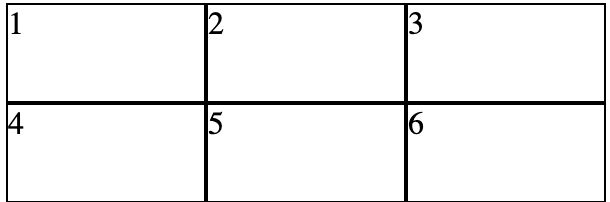

# 1. Grid
CSS grid è un sistema di layout che consente di creare reare layout bidimensionali, organizzando gli elementi in righe e colonne.
Il layout viene attivato su un elemento container 
``` CSS
div{
    display:grid;
}
```
Nei layout di css si possno definire delle propeità sul contenitore e alcune proprietà su singoli elementi della griglia.

Le proprietà più comuni per il contenitore sono grid-template-columns e grid-template-rows.- [Grid](#grid)


## 1.1. grid-template-columns e grid-template-rows

consentono di definire le colonne e le righe della griglia. Puoi specificare le dimensioni delle colonne e delle righe utilizzando unità di misura come pixel, percentuale o frazioni.

Vediamo un po di esempi:
- Esempio 1: Una griglia con tre colonne di larghezza uguale e due righe di altezza uguale.

``` CSS
.grid-container {
  display: grid;
  grid-template-columns: repeat(3, 1fr);
  grid-template-rows: repeat(2, 1fr);
}

.grid-item {
  border: 1px solid black;
}          
```
Questo creerà una griglia con tre colonne e due righe, ognuna delle quali avrà la stessa larghezza e altezza. I div avranno un bordo nero di 1px.



- Esempio 2: Una griglia di 4 colonne, ognuna larga 200 px, e 2 righe, ognuna alta 300 px.

``` CSS
.container {
  display: grid;
  grid-template-columns: 200px 200px 200px 200px;
  grid-template-rows: 300px 300px;
}
```


  

# 2. Flexbox
Flexbox detto anche Flexible Box Module è un sistema di layout CSS.
